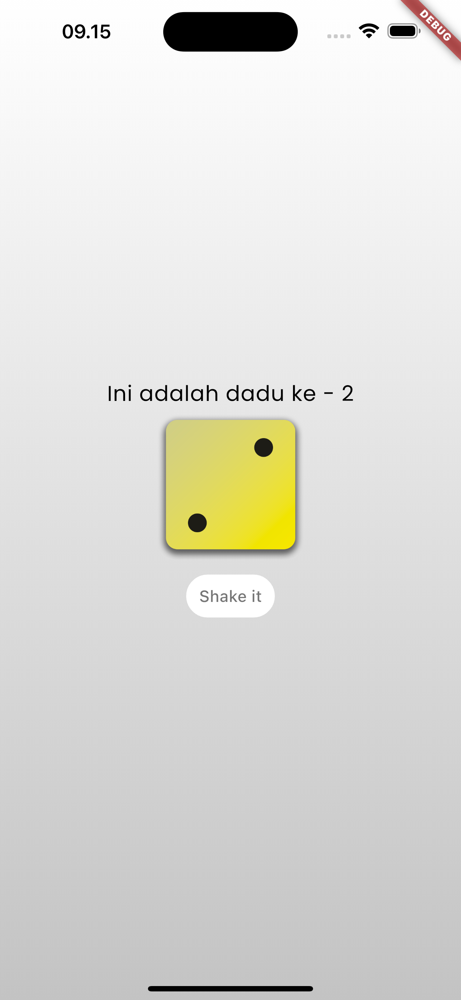

# 🎲 Random Dice

Learn flutter from udemy

  

## Section 2 - Resume

- **Dart** is an object-oriented programming language.
- **Flutter** uses the Dart language which is compiled into machine code when run on the operating system or Android.
- The `main.dart` file will be executed automatically when the application starts.
- The `runApp()` method is used to start the application.
- Flutter requires the `material.dart` package provided by Flutter.
- Flutter provides various widgets.
- Flutter supports the creation of reusable widgets known as custom widgets.
- All types in Dart are objects.
- Values can have multiple types.
- A **Stateless Widget** is a widget that has no internal data that changes; if anything changes, the UI will not update. Stateless widgets only require one class.
- A **Stateful Widget** is a widget that supports internal data that can change, which causes the UI to update when the data changes. Stateful widgets require more than one class
